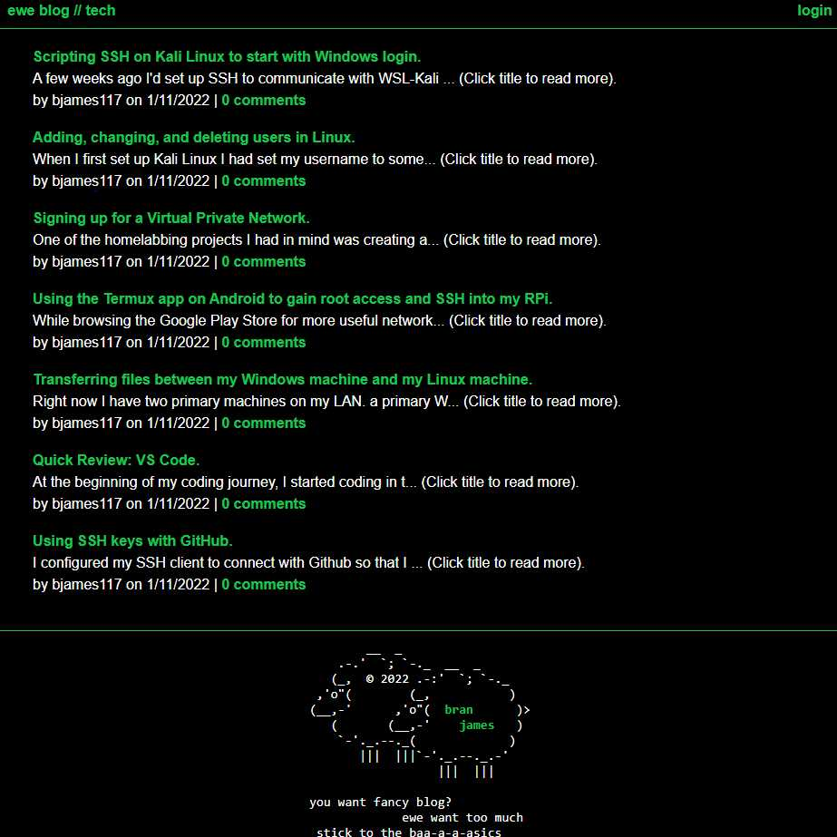

# Eweblog

## Description

Eweblog is a minimalistic CMS with front-end that leverages the Sequelize ORM to store user, post, comment, and session data in a MySQL server. It demonstrates CRUD functionality of data management with an MVC-styled application.

## Table of Contents

- [Installation](#installation)
- [Usage](#usage)
- [License](#license)
- [Questions](#questions)

## Installation

Install the source files with `git clone <url>`. Install dependencies with `npm i`. Edit environment variables.

## Usage

Begin the server with `node server`. Use Postman or Insomnia to test API routes. Sample website hosted on Heroku with JAWSDB [here](https://obscure-mesa-27013.herokuapp.com/).

## License

[The MIT License](https://mit-license.org/)

Copyright © 2022 branjames117

Permission is hereby granted, free of charge, to any person obtaining a copy of this software and associated documentation files (the “Software”), to deal in the Software without restriction, including without limitation the rights to use, copy, modify, merge, publish, distribute, sublicense, and/or sell copies of the Software, and to permit persons to whom the Software is furnished to do so, subject to the following conditions:

The above copyright notice and this permission notice shall be included in all copies or substantial portions of the Software.

THE SOFTWARE IS PROVIDED “AS IS”, WITHOUT WARRANTY OF ANY KIND, EXPRESS OR IMPLIED, INCLUDING BUT NOT LIMITED TO THE WARRANTIES OF MERCHANTABILITY, FITNESS FOR A PARTICULAR PURPOSE AND NONINFRINGEMENT. IN NO EVENT SHALL THE AUTHORS OR COPYRIGHT HOLDERS BE LIABLE FOR ANY CLAIM, DAMAGES OR OTHER LIABILITY, WHETHER IN AN ACTION OF CONTRACT, TORT OR OTHERWISE, ARISING FROM, OUT OF OR IN CONNECTION WITH THE SOFTWARE OR THE USE OR OTHER DEALINGS IN THE SOFTWARE.

## Questions

This repository was created and is maintained by [branjames117](https://github.com/branjames117).

With any questions email the repository owner at [branjames117@gmail.com](mailto:branjames117@gmail.com).
